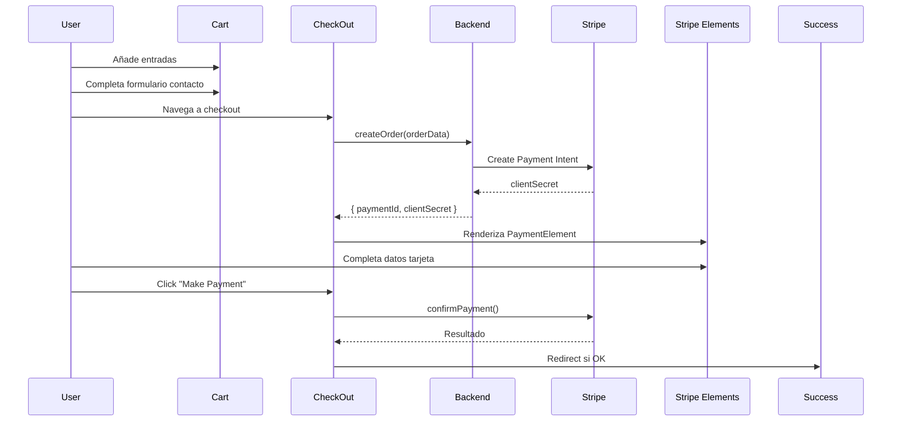

# FuturaTickets Event - Documentación del Proyecto

## 📋 Descripción General

**FuturaTickets Event** es una aplicación web moderna de venta de entradas para eventos construida con Next.js 15, React 19 (RC), TypeScript y Ant Design. La plataforma permite a los usuarios explorar eventos, comprar entradas, gestionar su cuenta, y participar en un mercado secundario de reventa de entradas.

---

## 🏗️ Arquitectura del Proyecto

### **Stack Tecnológico**

- **Framework**: Next.js 15.0.3 (App Router)
- **Frontend**: React 19 (RC), TypeScript 5
- **UI Library**: Ant Design 5.22.2
- **Estilos**: SASS 1.81.0
- **Pagos**: Stripe (react-stripe-js, stripe-js)
- **Autenticación**: Google OAuth (@react-oauth/google)
- **Mapas**: Google Maps (@vis.gl/react-google-maps)
- **Modo de Despliegue**: Standalone (Docker ready)

### **Estructura de Carpetas**

```
futura-tickets-event-main/
├── app/                          # Next.js App Router
│   ├── api/                      # API Routes (Next.js Server Actions)
│   │   ├── accounts/route.ts     # Gestión de cuentas
│   │   ├── orders/               # Gestión de pedidos
│   │   │   ├── route.ts          # Crear órdenes
│   │   │   ├── payment/route.ts  # Procesar pagos
│   │   │   └── config/route.ts   # Configuración Stripe
│   │   ├── events/[event]/route.tsx  # Eventos específicos
│   │   └── coupons/validate/route.ts # Validación cupones
│   ├── page.tsx                  # Página principal (Home)
│   ├── layout.tsx                # Layout principal
│   ├── login/page.tsx            # Login
│   ├── register/page.tsx         # Registro
│   ├── account/page.tsx          # Panel de usuario
│   ├── cart/                     # Carrito de compra
│   │   ├── page.tsx
│   │   └── checkout/page.tsx     # Proceso de pago
│   ├── resale/page.tsx           # Mercado de reventa
│   ├── success/page.tsx          # Confirmación de compra
│   └── verify/                   # Verificación de entradas
│       ├── page.tsx
│       └── [signature]/page.tsx
├── components/                   # Componentes React
│   ├── FuturaTickets.tsx         # Wrapper principal
│   ├── RootProvider.tsx          # Provider raíz
│   ├── GlobalStateProvider/      # Estado global
│   │   └── GlobalStateProvider.tsx
│   ├── shared/                   # Utilidades compartidas
│   │   ├── interfaces.tsx        # TypeScript interfaces
│   │   ├── services.tsx          # Servicios API
│   │   ├── utils.tsx             # Funciones utilidad
│   │   ├── Header/Header.tsx     # Cabecera
│   │   └── Footer/Footer.tsx     # Pie de página
│   ├── Event/Event.tsx           # Componente de evento
│   ├── Cart/Cart.tsx             # Carrito de compras
│   ├── CheckOut/                 # Proceso de pago
│   │   ├── CheckOut.tsx
│   │   └── CheckOut.constants.tsx
│   ├── Payment/Payment.tsx       # Componente de pago Stripe
│   ├── Login/Login.tsx           # Formulario login
│   ├── Register/Register.tsx     # Formulario registro
│   ├── Account/Account.tsx       # Panel de cuenta
│   ├── Resale/                   # Mercado secundario
│   │   ├── Resale.tsx
│   │   └── ResaleList/
│   │       ├── ResaleList.tsx
│   │       └── ResaleItem/ResaleItem.tsx
│   ├── Success/Success.tsx       # Página de éxito
│   └── Verify/Verify.tsx         # Verificación entradas
├── public/                       # Archivos estáticos
├── package.json
├── tsconfig.json
├── next.config.ts
├── Dockerfile
└── README.md
```

---

## 🧩 Componentes Principales

### **1. FuturaTickets (Wrapper Principal)**

**Ubicación**: `components/FuturaTickets.tsx`

**Responsabilidades**:
- Inicialización de la aplicación
- Carga del evento desde la variable de entorno `NEXT_PUBLIC_EVENT_ID`
- Validación de token de autenticación
- Gestión de estados de carga y error
- Configuración de promo codes desde query params

**Flujo de inicialización**:
```typescript
1. Lee token de localStorage o query params
2. Valida token con el backend
3. Si válido → decodifica y guarda datos de cuenta en estado global
4. Si inválido → limpia localStorage y redirige a /login
5. Carga evento desde API
6. Renderiza children si todo OK
```

**Estado manejado**:
- `loader`: Estado de carga
- `error`: Estado de error
- Dispatch de `account` y `promoCode` al estado global

---

### **2. GlobalStateProvider (Estado Global)**

**Ubicación**: `components/GlobalStateProvider/GlobalStateProvider.tsx`

**Interface del Estado Global**:
```typescript
interface GlobalState {
  account: Account | undefined;        // Usuario autenticado
  items: Item[];                       // Entradas en carrito (primarias)
  resaleItems: Item[];                 // Entradas de reventa en carrito
  clientDetails: ContactDetails | undefined; // Datos de contacto para pedido
  event: Event | undefined;            // Evento actual
  events: Event[];                     // Lista de eventos
  menuState: boolean;                  // Estado del menú móvil
  promoCode?: string;                  // Código promocional
  couponCode?: string;                 // Código de cupón
}
```

**Uso del hook**:
```typescript
const [state, dispatch] = useGlobalState();

// Actualizar estado
dispatch({ items: [...state.items, newItem] });
dispatch({ account: userData });
```

---

### **3. Event (Componente de Evento)**

**Ubicación**: `components/Event/Event.tsx`

**Funcionalidades**:
- Muestra información completa del evento
- Selector de tipos de entrada con control de cantidad
- Validación de cantidad máxima de entradas (`maxQuantity`)
- Integración con Google Maps para ubicación
- Gestión de carrito (añadir/quitar entradas)

**Sub-componente EventType**:
```typescript
// Gestiona la selección de cantidad por tipo de entrada
- addTicket(type, price): Añade entrada al carrito
- removeTicket(type): Elimina entrada del carrito
- totalTickets(): Calcula total de entradas en carrito
- Validación de límite máximo (event.maxQuantity)
```

**Secciones mostradas**:
- Imagen y header del evento
- Artistas asociados
- Descripción
- Condiciones
- FAQs
- Selector de entradas por tipo
- Fecha y hora de inicio
- Ubicación con mapa de Google
- Capacidad del evento

---

### **4. Cart (Carrito de Compras)**

**Ubicación**: `components/Cart/Cart.tsx`

**Características**:
- Muestra entradas normales y de reventa por separado
- Cálculo de precio total
- Cálculo de comisiones administrativas (`event.commission`)
- Formulario de detalles de contacto (nombre, apellido, fecha de nacimiento, email, teléfono)
- Validación de formulario con Ant Design Form
- Sistema de cupones de descuento
- Navegación condicional según autenticación

**Flujo de checkout**:
```typescript
1. Usuario añade entradas al carrito (desde Event o Resale)
2. En /cart → completa formulario de contacto
3. Opcional: aplica cupón de descuento
4. Valida formulario
5. Guarda clientDetails en estado global
6. Navega a /cart/checkout
```

**Cálculo de precios**:
```typescript
- Precio base: sum(items[i].price * items[i].amount)
- Comisión: precio_base * (event.commission / 100)
- Total: precio_base + comisión - descuento_cupón
```

---

### **5. CheckOut (Proceso de Pago)**

**Ubicación**: `components/CheckOut/CheckOut.tsx`

**Integración con Stripe**:
```typescript
1. Carga configuración de Stripe (clave pública)
2. Crea Payment Intent en backend
3. Recibe clientSecret
4. Renderiza Stripe Elements con PaymentElement
5. Usuario completa datos de pago
6. Confirma pago → redirige a /success
```

**Componentes**:
- **MakePayment**: Maneja confirmación del pago
- **Payment**: Wrapper del `PaymentElement` de Stripe

**Datos enviados en createOrder**:
```typescript
{
  event: event._id,
  promoter: event.promoter._id,
  contactDetails: { name, lastName, birthdate, email, phone },
  items: [...],           // Entradas normales
  resaleItems: [...],     // Entradas de reventa
  couponCode: string,     // Si aplica
  promoCode: string       // Si aplica
}
```

---

### **6. Account (Panel de Usuario)**

**Ubicación**: `components/Account/Account.tsx`

**Pestañas disponibles**:
```typescript
type ActiveTab = 'ACCOUNT' | 'TICKETS' | 'ORDERS' | 'PAYMENT';
```

**Funcionalidades por pestaña**:

1. **ACCOUNT**: Datos personales del usuario
2. **TICKETS**: Lista de entradas compradas
   - Ver QR de entrada
   - Poner en reventa
   - Transferir entrada
   - Cancelar reventa
3. **ORDERS**: Historial de pedidos
4. **PAYMENT**: Información de pago (futuro)

**Acciones sobre entradas**:
```typescript
- resaleTicket(saleId, resalePrice): Pone entrada en mercado de reventa
- cancelResaleTicket(saleId): Cancela reventa
- transferTicket(saleId, transferToTicket): Transfiere entrada a otro usuario
```

---

### **7. Resale (Mercado de Reventa)**

**Ubicación**: `components/Resale/Resale.tsx`

**Estructura**:
- **Resale.tsx**: Contenedor principal
- **ResaleList.tsx**: Lista de entradas en reventa
- **ResaleItem.tsx**: Item individual con precio y botón de compra

**Reglas de reventa**:
```typescript
- event.resale.isResale: Evento permite reventa
- event.resale.isActive: Reventa actualmente activa
- event.resale.maxPrice: Precio máximo de reventa
- event.resale.royalty: Comisión de reventa para el evento
```

**Flujo de compra**:
```typescript
1. Usuario ve entradas en reventa en /resale
2. Añade a carrito (resaleItems)
3. Proceso de checkout normal
4. Backend actualiza sale.status y gestiona transferencia
```

---

### **8. Verify (Verificación de Entradas)**

**Ubicación**: `components/Verify/Verify.tsx`

**Propósito**: Verificar validez de entradas en puerta de acceso

**Rutas**:
- `/verify`: Interfaz de verificación
- `/verify/[signature]`: Verifica signature de QR

**Proceso**:
```typescript
1. Escanea QR de entrada (contiene signature)
2. Llama a verifyTicket(eventId, signature)
3. Backend valida:
   - Entrada existe
   - Pertenece al evento
   - No ha sido usada previamente
   - Estado es OPEN
4. Si válida → marca como CLOSED
5. Muestra resultado
```

---

### **9. Login & Register**

**Login** (`components/Login/Login.tsx`):
- Login tradicional (email/password)
- Login con Google OAuth
- Almacena token JWT en localStorage
- Redirige a /account tras login exitoso

**Register** (`components/Register/Register.tsx`):
- Registro con email/password
- Validación de campos
- Crea cuenta en backend
- Redirige a /login tras registro exitoso

---

## 🔌 API Routes (Backend en Next.js)

### **POST /api/accounts/route.ts**
- Crea nueva cuenta de usuario
- Proxy a `${NEXT_PUBLIC_API_URL}/accounts`

### **POST /api/orders/route.ts**
- Crea nueva orden de compra
- Proxy a `${NEXT_PUBLIC_API_URL}/orders/create`

### **POST /api/orders/payment/route.ts**
- Confirma pago de Stripe
- Actualiza estado de orden

### **GET /api/orders/config/route.ts**
- Devuelve configuración pública de Stripe

### **GET /api/events/[event]/route.tsx**
- Obtiene datos de evento específico
- Proxy a API externa

### **POST /api/coupons/validate/route.ts**
- Valida cupón de descuento
- Retorna `{ valid, discount, code }` o error

---

## 📡 Servicios API (Frontend)

**Ubicación**: `components/shared/services.tsx`

### **Autenticación**
```typescript
validate(token: string): Promise<DecodedToken>
createAccount(data: CreateAccount): Promise<any>
loginAccount(data: LoginAccount): Promise<any>
loginGoogle(codeResponse: string): Promise<Account>
```

### **Eventos**
```typescript
getEvent(eventId: string): Promise<Event>
getEventResale(eventId: string): Promise<Sale[]>
```

### **Órdenes**
```typescript
createOrder(order: CreateOrder): Promise<{ paymentId, clientSecret }>
getAccountOrders(): Promise<Order[]>
makePayment(paymentIntentId: string): Promise<any>
```

### **Entradas**
```typescript
verifyTicket(event: string, ticket: string): Promise<TicketVerified>
resaleTicket(sale: string, resalePrice: number): Promise<Order[]>
cancelResaleTicket(sale: string): Promise<Order[]>
transferTicket(sale: string, transferToTicket: TransferToTicket): Promise<Order[]>
```

### **Cupones**
```typescript
validateCoupon(code: string, eventId: string): Promise<{
  valid?: boolean,
  discount?: number,
  code?: string,
  error?: string
}>
```

---

## 📦 Interfaces TypeScript Principales

**Ubicación**: `components/shared/interfaces.tsx`

### **Event**
```typescript
interface Event {
  _id: string;
  name: string;
  promoter: Promoter;
  conditions: Condition[];
  faqs: Faq[];
  dateTime: {
    launchDate: Date;
    startDate: Date;
    endDate: Date;
    startTime: Date;
    endTime: Date;
  };
  description: string;
  artists: Artist[];
  image: string;
  ticketImage: string;
  location: Location;
  symbol: string;
  capacity: number;
  maxQuantity: number;        // Máximo de entradas por compra
  commission: number;         // % de comisión administrativa
  resale: Resale;
  tickets: Ticket[];          // Tipos de entrada disponibles
  orders: Order[];
}
```

### **Ticket**
```typescript
interface Ticket {
  type: string;      // Ej: "VIP", "General", "Early Bird"
  capacity: number;  // Capacidad para este tipo
  price: number;     // Precio en EUR
}
```

### **Resale**
```typescript
interface Resale {
  isResale: boolean;   // Evento permite reventa
  isActive: boolean;   // Reventa actualmente activa
  maxPrice: number;    // Precio máximo de reventa permitido
  royalty: number;     // % de comisión para el evento
}
```

### **Order**
```typescript
interface Order {
  _id: string;
  account: string;
  event: string;
  items: Item[];
  sales?: Sale[];             // Entradas generadas
  paymentId: string;          // Stripe Payment Intent ID
  contactDetails: ContactDetails;
  status: OrderStatus;        // "PENDING" | "SUCCEEDED"
  createdAt: Date;
}
```

### **Sale (Entrada Individual)**
```typescript
interface Sale {
  _id: string;
  order?: string;
  event: {
    _id: string;
    name: string;
    address: string;
    dateTime: DateTime;
  };
  client: {
    name: string;
    lastName: string;
    email: string;
    phone?: string;
  };
  tokenId?: number;           // ID del NFT (si aplica)
  hash?: string;              // Hash blockchain (si aplica)
  type: string;               // Tipo de entrada
  price: number;
  resale?: {
    resalePrice: number;
    resaleDate: Date;
  };
  status: TicketStatus;
  qrCode: string;             // Código QR para verificación
  createdAt: Date;
}
```

### **TicketStatus**
```typescript
enum TicketStatus {
  PENDING = "PENDING",       // Pago pendiente
  PROCESSING = "PROCESSING", // Procesando
  OPEN = "OPEN",            // Válida para uso
  SALE = "SALE",            // En venta en mercado secundario
  SOLD = "SOLD",            // Vendida en mercado secundario
  CLOSED = "CLOSED",        // Ya usada/canjeada
  EXPIRED = "EXPIRED",      // Evento pasado
  TRANSFERED = "TRANSFERED" // Transferida a otro usuario
}
```

### **Account**
```typescript
interface Account {
  _id?: string;
  name: string;
  lastName: string;
  gender?: string;
  email: string;
  phone?: string;
  address?: string;          // Dirección blockchain (si aplica)
  balance?: number;
  role?: Roles;              // "Admin" | "User"
  avatar?: string;
  password?: string;
  token?: string;            // JWT token
}
```

### **Item (Entrada en Carrito)**
```typescript
interface Item {
  sale?: string;    // ID de Sale si es reventa
  type: string;     // Tipo de entrada
  amount: number;   // Cantidad
  price: number;    // Precio unitario
}
```

### **ContactDetails**
```typescript
interface ContactDetails {
  name: string;
  lastName: string;
  birthdate: Date;
  email: string;
  phone: string;
}
```

---

## 🔐 Autenticación y Autorización

### **Flujo de Autenticación**

1. **Login**:
   ```typescript
   loginAccount({ email, password })
     → Backend valida credenciales
     → Retorna JWT token
     → Frontend guarda en localStorage
     → Decodifica y guarda en estado global
   ```

2. **Login con Google**:
   ```typescript
   Google OAuth → codeResponse
     → loginGoogle(codeResponse)
     → Backend valida con Google API
     → Crea/actualiza cuenta
     → Retorna JWT token
   ```

3. **Validación de Token**:
   ```typescript
   validate(token)
     → Backend verifica firma JWT
     → Retorna DecodedToken con datos usuario
     → Si inválido → logout y redirect a /login
   ```

4. **Protección de Rutas**:
   - Componentes que requieren auth verifican `state.account`
   - Si `undefined` → redirigen a `/login`
   - Token se envía en header `Authorization: Bearer ${token}`

### **DecodedToken**
```typescript
interface DecodedToken {
  _id: string;
  account: string;      // Account ID
  name: string;
  lastName: string;
  email: string;
  address: string;      // Blockchain address (opcional)
  role: string;         // "Admin" | "User"
  iat: number;          // Issued at timestamp
  exp: number;          // Expiration timestamp
}
```

---

## 💳 Integración de Pagos (Stripe)

### **Flujo Completo**



### **Configuración de Stripe**

**Variables de entorno necesarias**:
```env
NEXT_PUBLIC_STRIPE_PUBLISHABLE_KEY=pk_...
STRIPE_SECRET_KEY=sk_...
```

**Aspecto visual** (`CheckOut.constants.tsx`):
```typescript
export const appearance = {
  theme: 'stripe',
  variables: {
    colorPrimary: '#0570de',
    colorBackground: '#ffffff',
    colorText: '#30313d',
    colorDanger: '#df1b41',
    fontFamily: 'system-ui, sans-serif',
    borderRadius: '4px'
  }
};
```

### **Componentes Stripe**

1. **Elements Provider**:
   ```typescript
   <Elements stripe={stripePromise} options={{ clientSecret, appearance }}>
     {children}
   </Elements>
   ```

2. **PaymentElement**:
   - Renderiza formulario de pago
   - Maneja validación de tarjeta
   - Soporta múltiples métodos de pago

3. **confirmPayment**:
   ```typescript
   await stripe.confirmPayment({
     elements,
     confirmParams: {
       return_url: `${window.location.origin}/success`
     }
   });
   ```

---

## 🛒 Gestión del Carrito

### **Estados del Carrito**

```typescript
// Estado global
items: Item[]           // Entradas normales
resaleItems: Item[]     // Entradas de reventa
```

### **Operaciones**

**Añadir entrada normal**:
```typescript
const addTicket = (type: string, price: number) => {
  const existingItem = state.items.find(item => item.type === type);

  if (!existingItem) {
    dispatch({ items: [...state.items, { type, amount: 1, price }] });
  } else {
    dispatch({
      items: state.items.map(item =>
        item.type === type
          ? { ...item, amount: item.amount + 1 }
          : item
      )
    });
  }
};
```

**Añadir entrada de reventa**:
```typescript
const addResaleTicket = (sale: Sale) => {
  dispatch({
    resaleItems: [
      ...state.resaleItems,
      {
        sale: sale._id,
        type: sale.type,
        amount: 1,
        price: sale.resale!.resalePrice
      }
    ]
  });
};
```

**Eliminar entrada**:
```typescript
const removeTicket = (type: string) => {
  dispatch({
    items: state.items
      .filter(item => item.type !== type || item.amount > 1)
      .map(item =>
        item.type === type && item.amount > 1
          ? { ...item, amount: item.amount - 1 }
          : item
      )
  });
};
```

**Limpiar carrito**:
```typescript
dispatch({ items: [], resaleItems: [] });
```

---

## 🔄 Mercado de Reventa

### **Configuración del Evento**

```typescript
event.resale = {
  isResale: true,        // Activa funcionalidad
  isActive: true,        // Permite compra/venta actual
  maxPrice: 100,         // Precio máximo en EUR
  royalty: 10            // 10% comisión para el evento
}
```

### **Poner Entrada en Reventa**

**Desde Account → TICKETS**:
```typescript
// Usuario introduce precio de reventa
const putOnResale = async () => {
  await resaleTicket(sale._id, resalePrice);

  // Backend actualiza:
  // sale.status → "SALE"
  // sale.resale.resalePrice → resalePrice
  // sale.resale.resaleDate → now()
};
```

**Validaciones**:
- `resalePrice <= event.resale.maxPrice`
- `sale.status === "OPEN"`
- Usuario es propietario de la entrada

### **Cancelar Reventa**

```typescript
await cancelResaleTicket(sale._id);

// Backend actualiza:
// sale.status → "OPEN"
// sale.resale → undefined
```

### **Comprar Entrada de Reventa**

**Flujo**:
1. Usuario navega a `/resale`
2. Ve lista de entradas disponibles (status: "SALE")
3. Añade a carrito en `resaleItems`
4. Procede con checkout normal
5. Backend crea nueva orden
6. Actualiza Sale original:
   - `status` → "SOLD"
   - Crea nueva Sale para comprador con status "OPEN"
7. Distribuye pago:
   - Vendedor original recibe: `resalePrice - royalty`
   - Evento recibe: `royalty`
   - Plataforma recibe: comisión administrativa

---

## 🎟️ Sistema de Cupones y Promociones

### **Tipos de Códigos**

1. **Promo Code**:
   - Se pasa por query param: `?promoCode=PROMO2024`
   - Se guarda en estado global
   - Se envía en `createOrder`
   - Procesado en backend (lógica personalizada)

2. **Coupon Code**:
   - Usuario introduce manualmente en Cart
   - Validación vía `/api/coupons/validate`
   - Retorna descuento aplicable
   - Se aplica antes de calcular total

### **Flujo de Validación de Cupón**

```typescript
// En Cart.tsx
const applyCoupon = async (code: string) => {
  try {
    const result = await validateCoupon(code, state.event._id);

    if (result.valid) {
      dispatch({ couponCode: result.code });
      setDiscount(result.discount);
      message.success(`Cupón aplicado: ${result.discount}% descuento`);
    } else {
      message.error(result.error || 'Cupón inválido');
    }
  } catch (error) {
    message.error('Error al validar cupón');
  }
};
```

### **Cálculo con Descuento**

```typescript
const subtotal = calculateTotalPrice();
const fees = calculateAdministrationFees();
const discountAmount = (subtotal * discount) / 100;
const total = subtotal + fees - discountAmount;
```

---

## 🗺️ Integración con Google Maps

### **Ubicación**: `components/Event/Event.tsx`

### **Configuración**

```typescript
<APIProvider apiKey={process.env.NEXT_PUBLIC_GOOGLE_MAPS_API_KEY}>
  <Map
    style={{ width: '100%', height: '420px' }}
    disableDefaultUI={true}
    defaultCenter={{ lat: event.location.lat, lng: event.location.lng }}
    defaultZoom={15}
  >
    <Marker position={{ lat: event.location.lat, lng: event.location.lng }} />
  </Map>
</APIProvider>
```

**Nota**: Actualmente el código tiene coordenadas hardcodeadas (Valencia). Debe actualizarse para usar `event.location.lat/lng` dinámicamente.

---

## 🚀 Despliegue

### **Modo Standalone**

`next.config.ts`:
```typescript
const nextConfig: NextConfig = {
  output: 'standalone'
};
```

Este modo genera una aplicación auto-contenida optimizada para Docker.

### **Dockerfile**

El proyecto incluye un `Dockerfile` para contenedorización:

```dockerfile
# Ejemplo de estructura (verificar archivo real)
FROM node:20-alpine
WORKDIR /app
COPY package*.json ./
RUN npm ci --only=production
COPY .next/standalone ./
COPY .next/static ./.next/static
COPY public ./public
EXPOSE 3002
CMD ["node", "server.js"]
```

### **Build Script**

`package.json`:
```json
{
  "scripts": {
    "build": "next build && cp -r .next/static .next/standalone/.next/ && cp -r public .next/standalone/"
  }
}
```

Este script:
1. Construye la app Next.js
2. Copia archivos estáticos a la carpeta standalone
3. Copia carpeta public

### **Variables de Entorno Necesarias**

```env
# API Backend
NEXT_PUBLIC_API_URL=https://api.futuratickets.com

# Event ID
NEXT_PUBLIC_EVENT_ID=event_id_here

# Stripe
NEXT_PUBLIC_STRIPE_PUBLISHABLE_KEY=pk_...
STRIPE_SECRET_KEY=sk_...

# Google Maps
NEXT_PUBLIC_GOOGLE_MAPS_API_KEY=AIza...

# Google OAuth (opcional)
NEXT_PUBLIC_GOOGLE_CLIENT_ID=...

# Blob Storage URL (imágenes)
NEXT_PUBLIC_BLOB_URL=https://storage.futuratickets.com
```

---

## 📱 Rutas de la Aplicación

| Ruta | Descripción | Autenticación |
|------|-------------|---------------|
| `/` | Página principal con info del evento | No |
| `/login` | Login de usuario | No |
| `/register` | Registro de nuevo usuario | No |
| `/cart` | Carrito de compras | No |
| `/cart/checkout` | Proceso de pago | No |
| `/success` | Confirmación post-compra | No |
| `/account` | Panel de usuario | **Sí** |
| `/resale` | Mercado de reventa | No |
| `/verify` | Verificación de entradas | No |
| `/verify/[signature]` | Validación de QR específico | No |

---

## 🎨 Estilos y Temas

### **Sistema de Estilos**

- **SASS/SCSS**: Todos los componentes tienen su archivo `.scss`
- **Ant Design**: Componentes UI base
- **CSS Modules**: Estilos con scope por componente

### **Estructura de Estilos**

```
components/
├── Event/
│   ├── Event.tsx
│   └── Event.scss
├── Cart/
│   ├── Cart.tsx
│   └── Cart.scss
└── ...
```

### **Personalización de Ant Design**

Los componentes de Ant Design se pueden personalizar con:
- Props de `className`
- Variables CSS/SASS globales
- ConfigProvider para temas globales

---

## 🔧 Utilidades y Helpers

**Ubicación**: `components/shared/utils.tsx`

### **formatTwoDigits**

```typescript
export const formatTwoDigits = (num: number): string => {
  return num.toString().padStart(2, '0');
};

// Uso: formatTwoDigits(9) → "09"
```

Utilizado para formatear horas/minutos en formato 24h.

---

## 🐛 Manejo de Errores

### **Patrón General**

```typescript
try {
  const result = await apiCall();
  // Procesar resultado
} catch (error) {
  console.log(error);
  // Mostrar mensaje de error al usuario
  message.error('Ocurrió un error');
}
```

### **Estados de Error**

- **FuturaTickets**: Muestra pantalla de error si falla carga de evento
- **Formularios**: Validación con Ant Design Form
- **API Calls**: Logs en consola (mejorar con sistema de logging)

---

## 📊 Flujos de Usuario Principales

### **1. Compra de Entrada Nueva**

```
1. Usuario entra a /
2. Ve evento y tipos de entrada
3. Selecciona cantidad por tipo
4. Click "Buy tickets" → /cart
5. Completa formulario de contacto
6. Opcionalmente aplica cupón
7. Click "Proceed to Payment" → /cart/checkout
8. Completa datos de pago (Stripe)
9. Click "Make Payment"
10. Stripe procesa pago
11. Redirect a /success
12. Recibe email con QR de entrada
```

### **2. Reventa de Entrada**

```
1. Usuario con entrada comprada va a /account
2. Click en pestaña "TICKETS"
3. Selecciona entrada a revender
4. Introduce precio de reventa
5. Click "Put on Resale"
6. Backend actualiza status → "SALE"
7. Entrada aparece en /resale para otros usuarios
```

### **3. Compra de Entrada de Reventa**

```
1. Usuario entra a /resale
2. Ve lista de entradas disponibles
3. Click "Add to Cart" en entrada deseada
4. Proceso de checkout igual que compra normal
5. Backend crea nueva Sale para comprador
6. Actualiza Sale original a "SOLD"
7. Distribuye pago entre vendedor y evento
```

### **4. Verificación de Entrada**

```
1. Personal del evento accede a /verify
2. Escanea QR de entrada asistente
3. App extrae signature del QR
4. Llama a verifyTicket(eventId, signature)
5. Backend valida y marca entrada como "CLOSED"
6. Muestra resultado: ✅ Válida o ❌ Inválida
```

---

## 🔒 Seguridad

### **Protecciones Implementadas**

1. **Autenticación JWT**:
   - Tokens firmados con secret
   - Validación en cada request protegido
   - Expiración configurada

2. **Validación de Datos**:
   - Formularios con Ant Design validation
   - Validaciones en backend (inferido)

3. **HTTPS**:
   - Todas las requests a API usan HTTPS
   - Stripe Payment Intent usa HTTPS

### **Mejoras Recomendadas**

1. **CSRF Protection**: Implementar tokens CSRF
2. **Rate Limiting**: Limitar requests por IP
3. **Input Sanitization**: Sanitizar inputs en backend
4. **Secure Headers**: Configurar headers de seguridad
5. **Environment Variables**: Nunca commitear secrets
6. **XSS Protection**: Validar y escapar outputs

---

## 📈 Optimizaciones y Mejores Prácticas

### **Implementadas**

- ✅ Next.js App Router para SSR y SSG
- ✅ TypeScript para type safety
- ✅ Standalone build para Docker
- ✅ Lazy loading de componentes (implícito en React)
- ✅ Estado global centralizado

### **Pendientes/Recomendadas**

- ⚠️ **Caching**: Implementar React Query o SWR para caching de requests
- ⚠️ **Optimización de Imágenes**: Usar Next.js Image component
- ⚠️ **Error Boundaries**: Añadir error boundaries en componentes clave
- ⚠️ **Loading States**: Mejorar UX con skeletons en lugar de spinners
- ⚠️ **Analytics**: Integrar Google Analytics o similar
- ⚠️ **SEO**: Añadir metadata y OpenGraph tags
- ⚠️ **Testing**: Implementar tests unitarios y E2E
- ⚠️ **Logging**: Sistema de logging estructurado (Winston, Pino)
- ⚠️ **Monitoring**: Sentry o similar para error tracking

---

## 🧪 Testing (Recomendaciones)

### **Herramientas Sugeridas**

- **Unit Tests**: Jest + React Testing Library
- **E2E Tests**: Playwright o Cypress
- **API Tests**: Supertest

### **Áreas Críticas a Testear**

1. **Flujo de compra completo**
2. **Validación de formularios**
3. **Cálculo de precios y comisiones**
4. **Autenticación y autorización**
5. **Integración con Stripe**
6. **Sistema de reventa**

---

## 📝 Comandos Útiles

```bash
# Desarrollo
npm run dev              # Inicia servidor en puerto 3002

# Build
npm run build            # Construye app para producción

# Producción
npm run start            # Inicia servidor de producción

# Linting
npm run lint             # Ejecuta ESLint
```

---

## 🗂️ Estructura de Datos Completa

### **Relaciones entre Entidades**

```
Event (1) ──── (N) Order
Event (1) ──── (N) Ticket (tipos)
Event (1) ──── (1) Resale (config)
Event (1) ──── (1) Promoter

Order (1) ──── (N) Sale (entradas individuales)
Order (1) ──── (1) Account

Sale (1) ──── (1) Event
Sale (1) ──── (1) Order
Sale (1) ──── (0..1) Resale (datos de reventa)

Account (1) ──── (N) Order
```

---

## 🎯 Flujo de Datos Completo

### **Estado Inicial**

```typescript
// Al cargar app
1. FuturaTickets se monta
2. Lee token de localStorage
3. Valida token → obtiene datos usuario
4. Carga evento desde NEXT_PUBLIC_EVENT_ID
5. Dispatch a GlobalState:
   - account: { _id, name, email, ... }
   - event: { _id, name, tickets, ... }
   - items: []
   - resaleItems: []
```

### **Añadir Entradas al Carrito**

```typescript
// Usuario en /
1. Selecciona tipo "VIP" y cantidad 2
2. Click "+" → addTicket("VIP", 50)
3. Dispatch: { items: [{ type: "VIP", amount: 2, price: 50 }] }
4. Estado se actualiza reactivamente
5. Botón "Buy tickets" se habilita
```

### **Checkout**

```typescript
// Usuario en /cart
1. Completa formulario contacto
2. Dispatch: { clientDetails: { name, lastName, ... } }
3. Click "Proceed to Payment"
4. Navega a /cart/checkout

// En /cart/checkout
5. useEffect → setStripeConfig()
6. Carga Stripe public key
7. createOrder(orderData) → Backend
8. Backend:
   - Crea Order en DB (status: PENDING)
   - Crea Payment Intent en Stripe
   - Retorna { paymentId, clientSecret }
9. Frontend renderiza Stripe Elements
10. Usuario completa datos tarjeta
11. Click "Make Payment"
12. confirmPayment() → Stripe
13. Stripe procesa pago
14. Webhook de Stripe → Backend
15. Backend:
    - Actualiza Order (status: SUCCEEDED)
    - Crea Sales individuales
    - Genera QR codes
    - Envía emails
16. Redirect a /success
```

---

## 🌐 Variables de Entorno (Resumen)

```env
# OBLIGATORIAS
NEXT_PUBLIC_API_URL=https://api.example.com
NEXT_PUBLIC_EVENT_ID=event_id
NEXT_PUBLIC_BLOB_URL=https://storage.example.com
NEXT_PUBLIC_STRIPE_PUBLISHABLE_KEY=pk_...
STRIPE_SECRET_KEY=sk_...

# OPCIONALES
NEXT_PUBLIC_GOOGLE_MAPS_API_KEY=AIza...
NEXT_PUBLIC_GOOGLE_CLIENT_ID=...
```

---

## 📚 Recursos Adicionales

- **Next.js Docs**: https://nextjs.org/docs
- **React Docs**: https://react.dev
- **Ant Design**: https://ant.design/components/overview
- **Stripe Docs**: https://stripe.com/docs
- **Google Maps API**: https://developers.google.com/maps

---

## 🆘 Troubleshooting

### **Error: "Token inválido"**

```typescript
// Solución
localStorage.removeItem('token');
// Volver a hacer login
```

### **Error: "Event not found"**

```typescript
// Verificar que NEXT_PUBLIC_EVENT_ID está configurado
// Verificar que el evento existe en backend
```

### **Stripe no carga**

```typescript
// Verificar NEXT_PUBLIC_STRIPE_PUBLISHABLE_KEY
// Verificar que getStripeConfig() retorna clave correcta
```

### **Google Maps no se muestra**

```typescript
// Verificar NEXT_PUBLIC_GOOGLE_MAPS_API_KEY
// Verificar que API está habilitada en Google Cloud Console
```

---

## 📊 Métricas y KPIs Sugeridos

1. **Conversión de Ventas**:
   - Visitantes → Añaden al carrito
   - Carrito → Completan compra

2. **Tiempo en Checkout**:
   - Tiempo promedio desde /cart hasta /success

3. **Tasa de Reventa**:
   - % de entradas puestas en reventa
   - Tiempo promedio hasta reventa

4. **Métodos de Pago**:
   - Distribución por tipo de tarjeta

5. **Errores de Pago**:
   - Tasa de fallos en Stripe
   - Razones de rechazo

---

## 🔮 Roadmap Futuro (Sugerencias)

1. **Blockchain Integration**:
   - NFT tickets en Ethereum/Polygon
   - Verificación on-chain

2. **Mobile App**:
   - React Native app
   - Compartir lógica de negocio

3. **Admin Dashboard**:
   - Gestión de eventos
   - Analytics en tiempo real
   - Gestión de asistentes

4. **Features Adicionales**:
   - Wishlists
   - Notificaciones push
   - Chat de soporte
   - Sistema de puntos/recompensas
   - Multi-idioma (i18n)

5. **Performance**:
   - CDN para assets
   - Redis para caching
   - GraphQL en lugar de REST

---

## 📞 Contacto y Soporte

Para soporte técnico o consultas sobre el código, contactar al equipo de desarrollo de FuturaTickets.

---

**Última actualización**: Octubre 2025
**Versión**: 0.1.0
**Mantenedores**: Equipo FuturaTickets
